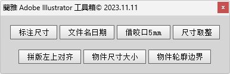
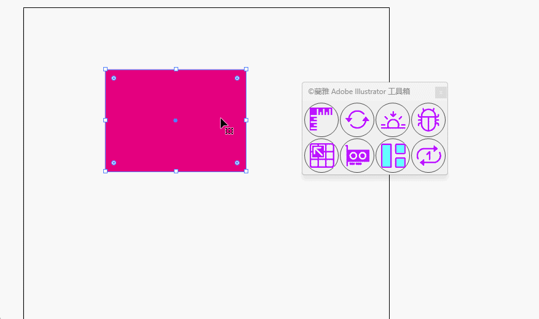
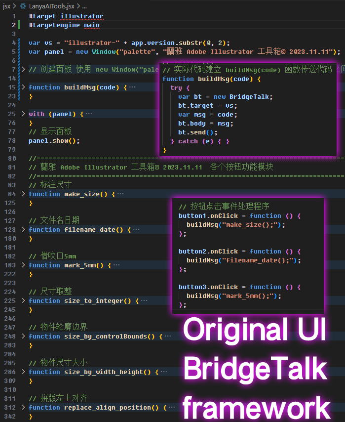
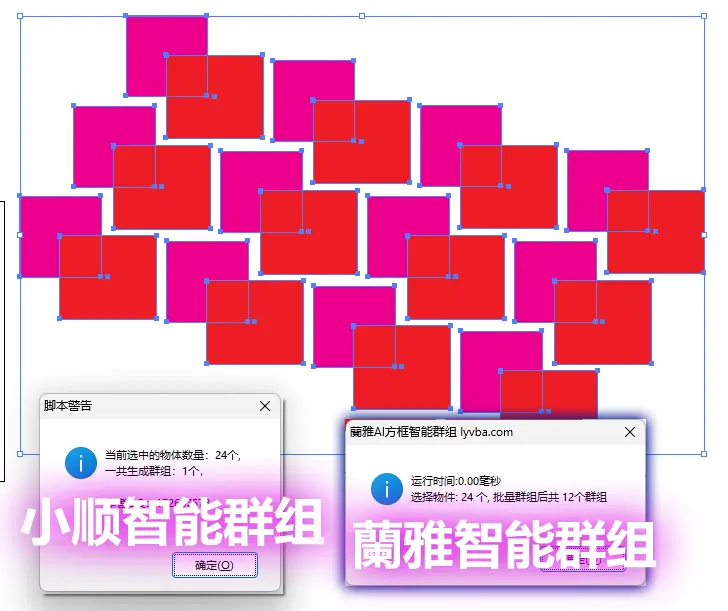

### [捐赠 蘭雅 Adobe Illustrator Scripts 开源项目](https://github.com/hongwenjun/corelvba/blob/main/donate.md)
- [频道](https://www.youtube.com/sRGB18/videos) &nbsp;&nbsp;www.youtube.com/sRGB18 &nbsp;&nbsp;[赞赏支持!](https://paypal.me/sRGB18)&nbsp;&nbsp;https://paypal.me/sRGB18

# Adobe_Illustrator_Scripts
Some powerfull JSX scripts for extending Adobe Illustrator
This is a collection of JS scripts for Adobe Illustrator. All scripts created by me, sometimes using parts of other authors’code. 

## [蘭雅 Adobe Illustrator 工具箱© 2023.11.11](./jsx/LanyaAITools.jsx)

##  2023.11.25 Update Using Icon GUI

## Original UI BridgeTalk framework

## [Adobe Illustrator JSX script demo using BridgeTalk to communicate with palette window.jsx](./jsx/Adobe%20Illustrator%20JSX%20script%20demo%20using%20BridgeTalk%20to%20communicate%20with%20palette%20window.jsx)

## [Adobe Illustrator 方框智能群组，等了好多年自己终于写好了 autogroup.jsx](./jsx/autogroup.jsx)

## Other Adobe Illustrator Scripts
- https://github.com/creold/illustrator-scripts
- https://github.com/Silly-V/Adobe-Illustrator